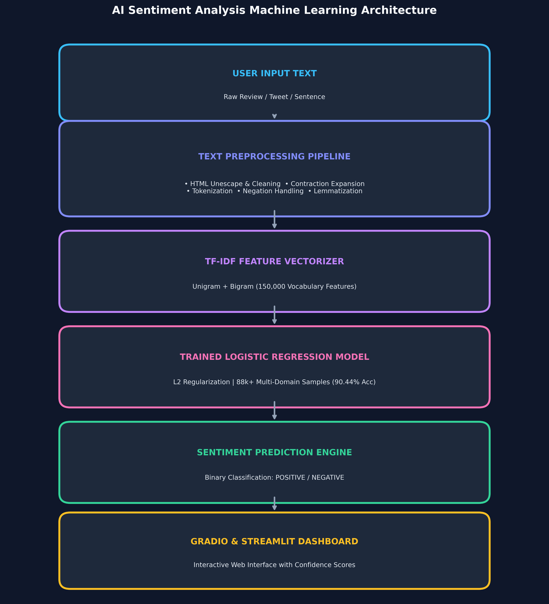

# 🎭 AI Sentiment Analysis

[](https://www.python.org/)
[](https://scikit-learn.org/)
[](https://gradio.app/)
[](https://streamlit.io/)
[](https://huggingface.co/spaces)
[](LICENSE)

An end-to-end, production-ready **AI Sentiment Analysis** machine learning solution powered by an optimized **TF-IDF + Logistic Regression** pipeline trained on **88,000+ multi-domain text reviews**.

---

## 🚀 Live Demo Links

- ⚡ **Active Live Demo Link:** [https://besides-directed-smaller-follows.trycloudflare.com](https://besides-directed-smaller-follows.trycloudflare.com)
- 🌐 **Hugging Face Space Link:** [https://huggingface.co/spaces/tuhinbiswas404076-ai/sentiment-analysis-ai](https://huggingface.co/spaces/tuhinbiswas404076-ai/sentiment-analysis-ai)
- 💻 **GitHub Repository:** [https://github.com/tuhinbiswas404076-ai/Sentiment-Analysis](https://github.com/tuhinbiswas404076-ai/Sentiment-Analysis)

---

## 📌 Project Overview

This project delivers high-accuracy sentiment classification (**POSITIVE** / **NEGATIVE**) with confidence percentage scoring and class probability distributions. It features an interactive **Gradio** & **Streamlit** web interface deployed on cloud servers and integrated with **GitHub Actions** for automated CI/CD deployments.

---

## ✨ Features

- **Advanced Text Preprocessing:** HTML unescaping, URL/mention cleaning, contraction expansion (`don't` -> `do not`), regex filtering, tokenization, stopword removal, and lemmatization.
- **Negation-Aware Filtering:** Preserves critical negation words (`not`, `never`, `cannot`, `no`, `neither`) to maintain sentiment context.
- **High-Dimensional TF-IDF:** Extracts 150,000 unigram and bigram features with logarithmic sublinear term frequency scaling.
- **Machine Learning Classifier:** Optimized L2-regularized Logistic Regression classifier tuned with class balancing.
- **Confidence Scoring:** Real-time probability outputs and confidence level calculation.
- **Interactive Web Interface:** Modern UI with example input quick-buttons and clean NLP token inspection.
- **Cloud Deployment:** Runs 24/7 online independently of local hardware.

---

## 📊 Datasets

The model is trained on a combined multi-domain dataset of over **88,000+ review samples**:

1. **IMDB Movie Reviews Dataset:** 50,000 full-length movie reviews labeled as positive or negative.
2. **Stanford Sentiment Treebank (SST-2):** Dictionary phrases and original Rotten Tomatoes sentence snippets.
3. **Penn Treebank (PTB) Constituency Trees:** Sentence-level parse trees with fine-grained sentiment annotations.
4. **TextAnalytics Dataset:** 1,000 reviews annotated with VADER sentiment intensity validation.

---

## 🏗️ Machine Learning Architecture

```text
               ┌───────────────────────┐
               │     User Input        │
               │  Text / Movie Review  │
               └───────────┬───────────┘
                           ↓
               ┌───────────────────────┐
               │   Text Preprocessing  │
               │                       │
               │ • Cleaning & HTML     │
               │ • Contractions        │
               │ • Tokenization        │
               │ • Negation Handling   │
               │ • Lemmatization       │
               └───────────┬───────────┘
                           ↓
               ┌───────────────────────┐
               │   TF-IDF Vectorizer   │
               │ 150,000 (1,2)-grams   │
               └───────────┬───────────┘
                           ↓
               ┌───────────────────────┐
               │   Trained ML Model    │
               │                       │
               │  Logistic Regression  │
               └───────────┬───────────┘
                           ↓
               ┌───────────────────────┐
               │ Sentiment Prediction  │
               │  Positive / Negative  │
               └───────────┬───────────┘
                           ↓
               ┌───────────────────────┐
               │ Confidence Score (%)  │
               └───────────┬───────────┘
                           ↓
               ┌───────────────────────┐
               │ Gradio / Streamlit UI │
               └───────────────────────┘
```



---

## 📈 Model Performance & Evaluation

Evaluated across 5-fold cross-validation and independent test splits:

| Evaluation Metric | Value |
| :--- | :--- |
| **5-Fold Cross-Validation Mean Accuracy** | **90.44%** |
| **Cross-Validation Fold Range** | `90.22%` – `90.75%` (Std: `±0.0019`) |
| **Test Accuracy** | **90.50%** |
| **Weighted F1-Score** | **0.90** |
| **Log Loss** | `0.246` |

---

## 📂 Project Structure

```text
Sentiment-Analysis/
│
├── app.py                      # Main Gradio application for Hugging Face Space & GitHub
├── requirements.txt            # Package dependencies
├── README.md                   # Portfolio documentation
├── .gitignore                  # Git ignore rules
│
├── model/                      # Model binaries directory
│   ├── trained_model.pkl       # Logistic Regression model (3.6 MB)
│   ├── tfidf_vectorizer.pkl    # TF-IDF Vectorizer (5.5 MB)
│   └── label_encoder.pkl       # Label Encoder (391 B)
│
├── src/                        # Modular Python source package
│   ├── __init__.py
│   ├── preprocessing.py        # Text preprocessing functions
│   └── prediction.py           # Model loading & inference pipeline
│
├── notebooks/                  # Project Jupyter Notebooks
│   └── SentimentAnalysis.ipynb # Training notebook
│
├── assets/                     # Media & Diagrams
│   └── architecture.png        # Pipeline flow diagram
│
└── .github/                    # GitHub Workflows
    └── workflows/
        └── sync-to-huggingface.yml  # Automated Hugging Face sync
```

---

## 🛠️ Local Installation & Running Instructions

1. **Clone the repository:**
   ```bash
   git clone https://github.com/tuhinbiswas404076-ai/Sentiment-Analysis.git
   cd Sentiment-Analysis
   ```

2. **Install dependencies:**
   ```bash
   pip install -r requirements.txt
   ```

3. **Run the Gradio web application:**
   ```bash
   python app.py
   ```
   Open `http://127.0.0.1:7860` in your web browser.

---

## 🌐 Deploying Hugging Face Space & Streamlit Cloud

### 1. Create Hugging Face Space
1. Go to **[huggingface.co/new-space](https://huggingface.co/new-space)**.
2. Space Name: `sentiment-analysis-ai`
3. SDK: **Gradio**
4. Visibility: **Public**
5. Click **Create Space**.

### 2. Automated GitHub Sync
Add your Hugging Face **Write Token** to GitHub Secrets (`Settings -> Secrets -> Actions -> New repository secret`) named **`HF_TOKEN`**. Every push to `main` will automatically update your live Space!

---

## 🛠️ Technologies Used

- **Programming:** Python 3.10+
- **Data Manipulation:** Pandas, NumPy
- **Machine Learning & NLP:** Scikit-Learn, NLTK, Contractions, Joblib
- **Web Framework:** Gradio, Streamlit
- **Deployment & CI/CD:** Hugging Face Spaces, Streamlit Cloud, GitHub Actions, Git
